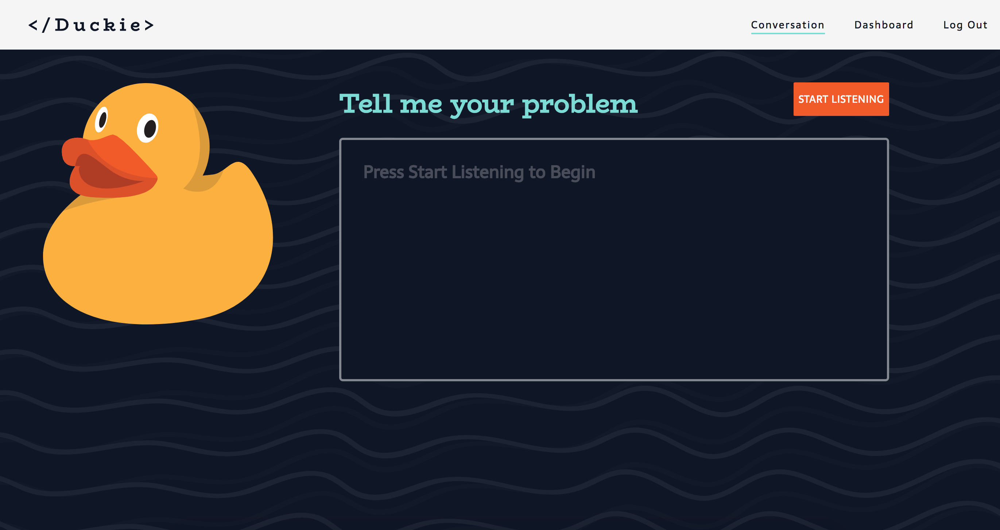

# Duckie

##### Are you stuck? Talk to the Duck!

##### Provides speech to text transcription and keyword analysis to help the user improve their coding skills.

* Duckie Front End Repo - https://github.com/johneckert/duckie-frontend
* Duckie Back End Repo - https://github.com/johneckert/duckie-backend

# Demo

<!-- [Watch Demo on Youtube](https://www.youtube.com/watch?v=https://youtu.be/Dc_FGiS7ZEU) -->

# How To Use

* A browser tool for rubber duck debugging!
* Duckie uses the WebSpeech API to listen to you describe what you are stuck on.
* It will then scan what you said for keywords to help you identify your problem.
* It then ranks those keywords by frequency and importance.

### Prerequsites

* Google Chrome (More browsers coming soon!)
* Ruby v5.1.5
* PostgreSQL 10
* React/Redux

### Back End Setup

1.  Clone this repo - https://github.com/johneckert/duckie-backend
2.  Install Gems `bundle install`
3.  Setup Database `rake db:create`, then `run rake db:migrate`
4.  Start your server `rails s`

### Front End Setup

1.  Clone this repo - https://github.com/johneckert/duckie-frontend
2.  Install Dependencies `yarn install`
3.  Start your server `yarn start`

### In Your Browser

Navigate to the web address of your Node server http://localhost:3001 - or whatever yours is.
